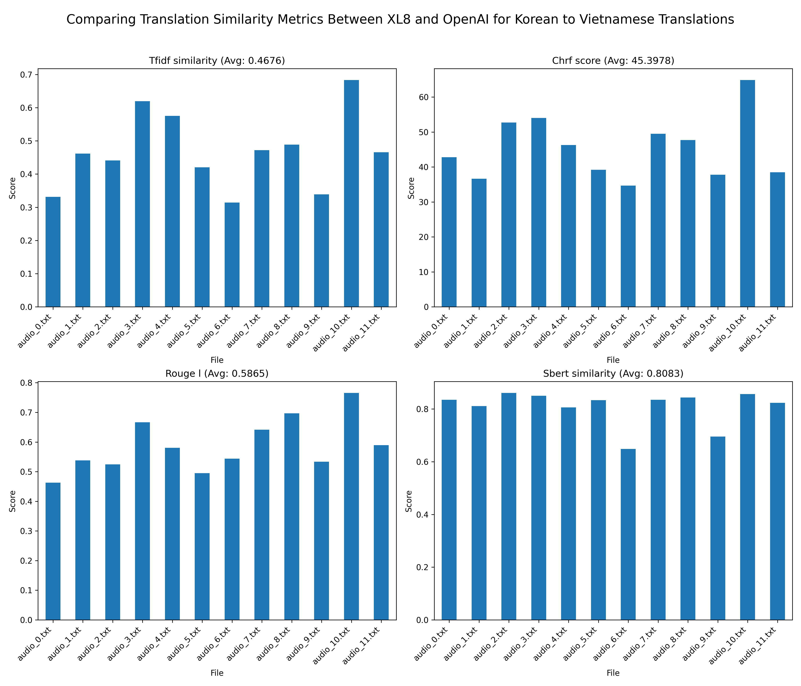
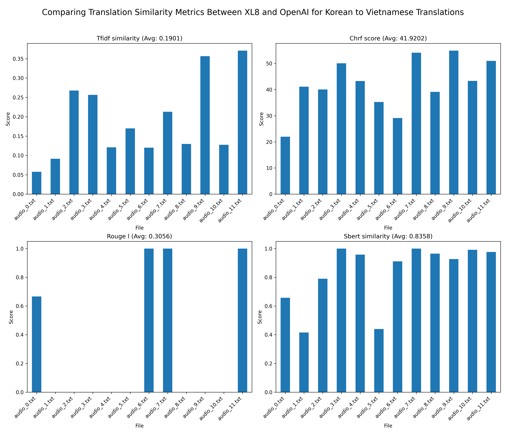
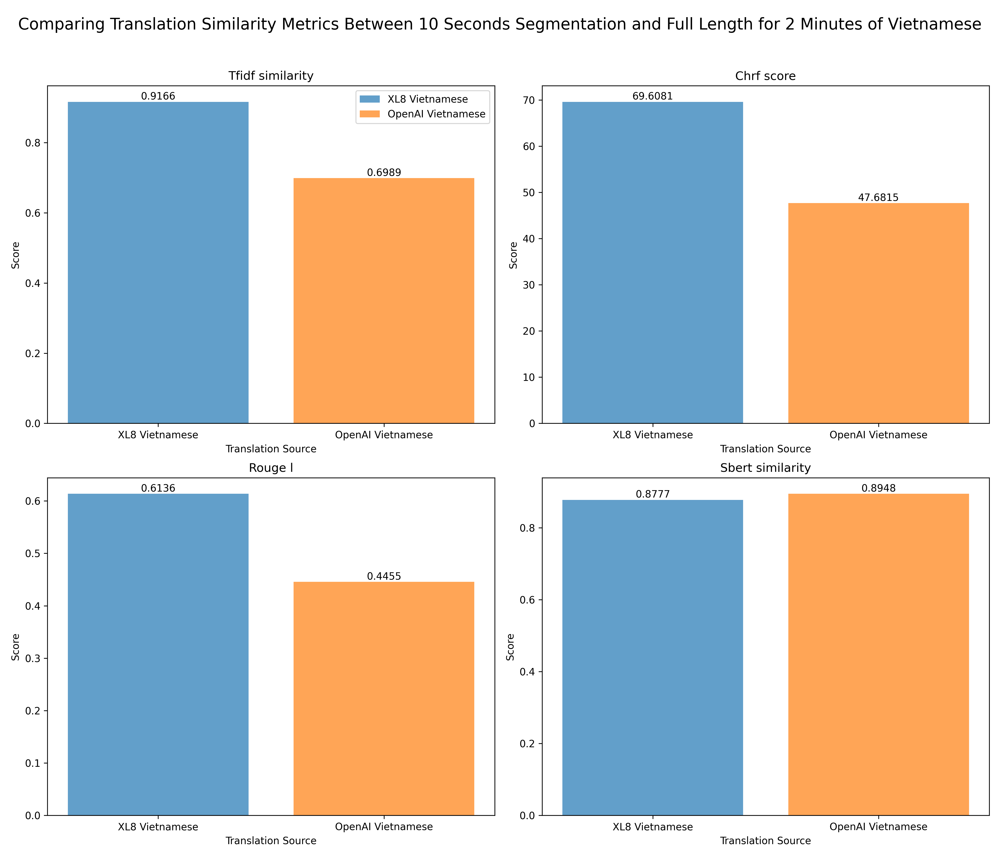
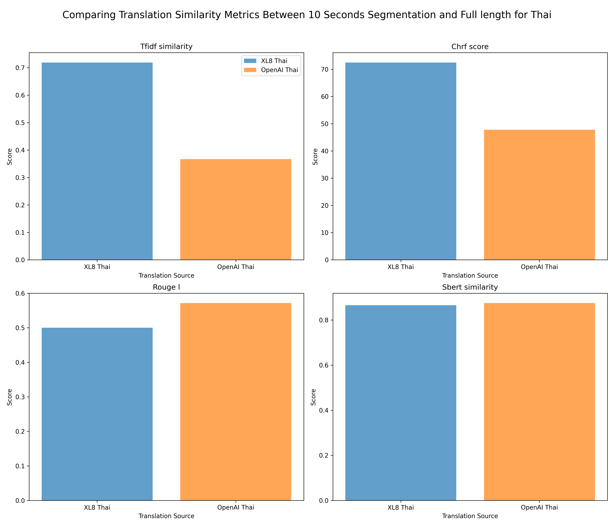

# Real-time Live Streaming Multilingual Subtitles System

## Prerequisite and Installation

Python 3.12 and FFmpeg version 7.1

### Required Libraries

#### FFmpeg Library

- For Mac, please use `brew install ffmpeg`
- To deploy on a Linux server, follow this guideline: [FFmpeg Compilation Guide for Ubuntu](https://trac.ffmpeg.org/wiki/CompilationGuide/Ubuntu#FFmpeg) to install the latest version instead of using `apt install`.

### Project Configuration

```bash
# Create virtual environment
python3 -m venv venv

# Activate environment
source venv/bin/activate

# Install requirements
pip3 install -r requirements.txt

# If there are additional libraries installed during development, please update requirements.txt
pip3 freeze > requirements.txt
```

### Running the Server

```bash
uvicorn app.main:app --reload
```

Swagger UI for API documentation can be accessed at [http://127.0.0.1:8000/docs](http://127.0.0.1:8000/docs)

## Project Structure Overview

```plaintext
live-streaming-system/
├── app/
│   ├── __init__.py                # Initialization file for the app module
│   ├── main.py                    # Entry point for the FastAPI application
│   ├── core/
│   │   ├── __init__.py
│   │   └── config.py              # Configuration settings for the project
│   ├── api/
│   │   ├── __init__.py
│   │   ├── api_v1/
│   │   │   ├── __init__.py
│   │   │   ├── api.py             # API routing for version 1
│   │   │   ├── endpoints/
│   │   │   │   ├── __init__.py
│   │   │   │   ├── live_stream.py # Endpoints related to live streaming
│   ├── media/
│   │   ├── audio                  # Store the audio segmentation
|   |   ├── chunks                 # Store the video segmentation
|   |   ├── playlists              # Store the playlist.m3u8 ~ Output file of our service
|   |   ├── subtitles              # Store the subtitles (Output from Whisper model)
|   |   ├── translations           # Store the translation (Having sub folder based on language code `vi`, `th`)
│   ├── models/
│   │   ├── __init__.py            # Placeholder for database models
│   ├── schemas/
│   │   ├── __init__.py
│   │   ├── live_stream.py         # Pydantic schemas for live streaming
│   ├── services/
│   │   ├── __init__.py
│   │   ├── live_stream_service.py # Implementation logic for live stream service
│   │   ├── audio_service.py       # Implementation logic for audio service
│   │   ├── video_service.py       # Implementation logic for video service
│   │   ├── stt_service.py         # Implementation logic for speech-to-text service
│   │   ├── translation_service.py # Implementation logic for translation service
│   ├── static/                    # Storing our frontend implementation using HLS library for demo as user side using our API endpoint
│   ├── workers/
│   │   ├── __init__.py
│   │   ├── background_tasks.py    # Background task management
│   └── db/
│       ├── __init__.py
│       ├── base.py                # Base model class for ORM
│       └── session.py             # Database session management
├── benchmarking/
│   ├── results/                   # Folder containing benchmarking results
├── .env                           # Environment variables
├── .gitignore                     # Git ignore file
├── requirements.txt               # Project dependencies
├── .github                        # GitHub configuration for CI/CD and GitHub PR/Issues Template
└── README.md                      # Project documentation
```

## Testing Guide

1. Copy `.env.example` and rename it to `.env`. Add the API key to this environment variable file.
2. Run the server with the following command:

```bash
uvicorn app.main:app --reload
```

3. Execute the `.m3u8` input link (e.g., `http://cache1.castiscdn.com:28080/snu/live.stream/tsmux_master.m3u8`) via the API documentation at [http://127.0.0.1:8000/docs#/live_stream/process_video_endpoint_api_v1_live_process_stream__post](http://127.0.0.1:8000/docs#/live_stream/process_video_endpoint_api_v1_live_process_stream__post).

4. Open the custom video player via HLS.js Demo (https://github.com/video-dev/hls.js) with the streaming video output endpoint `http://127.0.0.1:8000/api/v1/streaming/index.m3u8` to view the processed streaming video.

## Benchmarking Results

### Benchmarking Results for Speech-to-Text 

We ran 12 audio files with a total duration of 2 minutes.

- **Groq**: Consistently has the lowest transcription time, averaging 0.46 seconds, with little variation across all audio files.
- **OpenAI**: Moderate performance, with an average time of 1.60 seconds. There is a slight upward trend for some audio files (e.g., audio_3.wav and audio_6.wav).
- **Whisper Local**: Significantly slower, averaging 13.47 seconds per file. It shows a clear downward trend initially, stabilizing around 13–14 seconds after audio_2.wav.


#### Benchmarking Results for Translation (Between XL8.ai and OpenAI)

For benchmarking the translation output, we prepared 12 .txt files in the subtitles folder. Each file is the output of the text-to-speech service from 10 seconds length. Thus, the total length of audio for evaluation is 2 minutes.

For each audio, we use XL8.ai and GPT-4 from OpenAI to make the translation data for Vietnamese and Thai languages.

We use the following metrics to compare the similarity between translations:

- **TF-IDF**: Provides quick similarity between two texts based on word occurrences. It assigns higher weights to words that appear frequently in a document but rarely in other documents.
- **ChrF**: Measures the similarity between two texts at the character level, making it more robust to paraphrasing, word reordering, and morphological variations.
- **ROUGE-L**: Evaluates the Longest Common Subsequence (LCS) between two texts. It measures structural similarity, including word overlap and sentence structure alignment. Note that because the Thai language does not use spaces to separate words, the ROUGE-L metric is less useful for Thai.
- **SBERT (Sentence-BERT)**: Measures the semantic similarity between two texts. It evaluates whether two sentences have the same meaning, regardless of word order or word choice. (Using Sentence Transformer model)

#### Results for Korean to Vietnamese Translation



#### Results for Korean to Thai Translation



### Benchmarking Results for Speech-to-text (Using XL8.ai comparing between 10-second-segmentation and full duration translation)

In this second experiment, we benchmark the translation quality between the 10 segmentation and full size duration. For full size duration, we translate 2-minute-audio using both service. On the other hand, we merged the translation results of 12 10-second-segmentation. Then comparing using the above method

#### Results for Korean to Vietnamese Translation



#### Results for Korean to Thai Translation



According to the graph, we can see the high similarity score of SBERT, thus, the meaning of translation between cutting 10 seconds and full length are quite similar. On the other hand, we also see the outperform comparision score by using XL8 comparing to OpenAI for translation task. 

### Benchmarking Results for Delay Time

The simulation evaluates the delay time comparing the latest content of streaming input. The goal is to analyze the time required for content to pass through various processing stages, including video and audio segmentation, transcription, translation, and synchronization. As we parallel processing the with multiple workers, so the delay time is only the total time for processing one chunk.

Average time for video/ audio segmentation is around 10.1 seconds.

Average time for transcription process (OpenAI Whisper response and cron job processing): 7.8 seconds 

Average time for translation process (XL8.ai translation and cron job for creating subtitles): 8.4 seconds

Average time for synchronization of m3u8 playlist is around 0.01 seconds.

The total delay time is around ~26.3 seconds. 

We also perform the simulation with HLS.js library. At a delay rate of around 27 seconds, the video with subtitles runs smoothly.