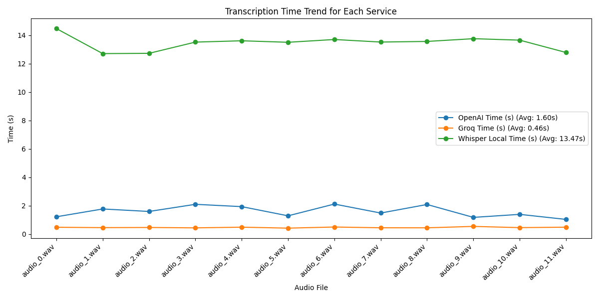
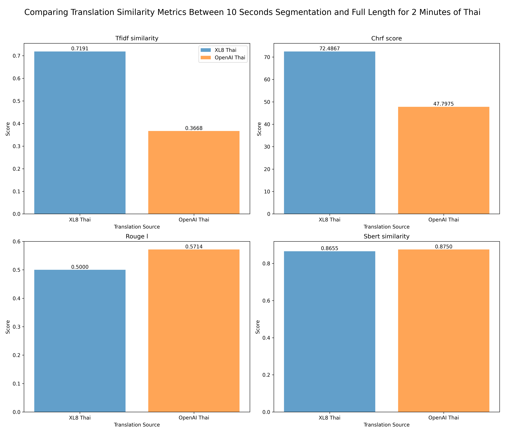

# Real-time Live Streaming Multilingual Subtitles System

## User Manual

### Prerequisites and Installation

Ensure you have the following installed:

- **Python 3.12**
- **FFmpeg** (version 7.1 or later)

#### Installing FFmpeg

- **Mac**: Use the following command to install FFmpeg:
  ```bash
  brew install ffmpeg
  ```
- **Linux**: Using the [FFmpeg Compilation Guide for Ubuntu](https://trac.ffmpeg.org/wiki/CompilationGuide/Ubuntu#FFmpeg) to install the latest version and build from source to having full support features.

### Project Configuration

1. **Create a Virtual Environment**
   ```bash
   python3 -m venv venv
   ```

2. **Activate the Environment**
   ```bash
   source venv/bin/activate
   ```

3. **Install Dependencies**
   ```bash
   pip3 install -r requirements.txt
   ```

4. **Update Requirements File** (if new libraries are added during development):
   ```bash
   pip3 freeze > requirements.txt
   ```

### Setting Up Environment Variables

1. Copy the `.env.example` file:
   ```bash
   cp .env.example .env
   ```
2. Add the necessary API keys and other environment-specific variables to the `.env` file.

### Running the Server

Start the server with the following command:

```bash
uvicorn app.main:app --reload
```

Once running, access the Swagger UI for API documentation at:
[http://127.0.0.1:8000/docs](http://127.0.0.1:8000/docs)

### Processing Input Streaming `.m3u8` URL

To process an `.m3u8` input link (e.g., `http://cache1.castiscdn.com:28080/snu/live.stream/tsmux_master.m3u8`):

1. Open the API documentation in Swagger UI: [http://127.0.0.1:8000/docs#/live_stream/process_video_endpoint_api_v1_live_process_stream__post](http://127.0.0.1:8000/docs#/live_stream/process_video_endpoint_api_v1_live_process_stream__post).

2. Use the **`POST`** endpoint to submit the `.m3u8` URL for processing.

### Demo

#### Viewing the Processed Streaming Video

To view the processed `.m3u8` output stream with subtitles, use HLS.js:

1. **Install HLS.js**
   ```bash
   git clone https://github.com/video-dev/hls.js.git
   cd hls.js
   npm install
   npm run dev
   ```

2. Open the HLS.js Demo interface.
3. Enter the output endpoint from your server (e.g., `http://127.0.0.1:8000/api/v1/streaming/index.m3u8`) into the HLS.js player to view the processed streaming video.


## Project Structure Overview

## Project Structure Overview

```plaintext
live-streaming-system/
├── app/
│   ├── __init__.py                # Initialization file for the app module
│   ├── main.py                    # Entry point for the FastAPI application
│   ├── core/
│   │   ├── __init__.py
│   │   └── config.py              # Configuration settings for the project
│   ├── api/
│   │   ├── __init__.py
│   │   ├── api_v1/
│   │   │   ├── __init__.py
│   │   │   ├── api.py             # API routing for version 1
│   │   │   ├── endpoints/
│   │   │   │   ├── __init__.py
│   │   │   │   ├── live_stream.py # Endpoints related to live streaming
│   ├── media/                     # This folder will be automatically generated when processing the input streaming URL
│   │   ├── audio                  # Store the audio segmentation
|   |   ├── chunks                 # Store the video segmentation
|   |   ├── playlists              # Store the playlist.m3u8 ~ Output file of our service
|   |   ├── subtitles              # Store the subtitles (Output from Whisper model)
|   |   ├── translations           # Store the translation (Having sub folder based on language code `vi`, `th`)
│   ├── models/
│   │   ├── __init__.py            # Placeholder for database models
│   ├── schemas/
│   │   ├── __init__.py
│   │   ├── live_stream.py         # Pydantic schemas for live streaming
│   ├── services/
│   │   ├── __init__.py
│   │   ├── live_stream_service.py # Implementation logic for live stream service
│   │   ├── audio_service.py       # Implementation logic for audio service
│   │   ├── video_service.py       # Implementation logic for video service
│   │   ├── stt_service.py         # Implementation logic for speech-to-text service
│   │   ├── translation_service.py # Implementation logic for translation service
│   ├── static/                    # Storing our frontend implementation using HLS library for demo as user side using our API endpoint
│   ├── workers/
│   │   ├── __init__.py
│   │   ├── background_tasks.py    # Background task management
│   └── db/
│       ├── __init__.py
│       ├── base.py                # Base model class for ORM
│       └── session.py             # Database session management
├── benchmarking/                  # Folder containing the data and implementation for benchmarking
│   ├── results/                   # Folder containing benchmarking results
├── docs                           # Folder containing docs and public media
├── .env                           # Environment variables
├── .gitignore                     # Git ignore file
├── requirements.txt               # Project dependencies
├── .github                        # GitHub configuration for CI/CD and GitHub PR/Issues Template
└── README.md                      # Project documentation
```

## Benchmarking Results

### Experiment 1: Benchmarking the response time of Speech to Text API services

We ran 12 audio files with a total duration of 2 minutes.

- **Groq**: Consistently has the lowest transcription time, averaging 0.46 seconds, with little variation across all audio files.
- **OpenAI**: Moderate performance, with an average time of 1.60 seconds. There is a slight upward trend for some audio files (e.g., audio_3.wav and audio_6.wav).
- **Whisper Local**: Significantly slower, averaging 13.47 seconds per file. It shows a clear downward trend initially, stabilizing around 13–14 seconds after audio_2.wav.



### Experiment 2: Benchmarking the translation quality of our service

### Experiment 2.1: Benchmarking the similirity of translation between XL8.ai and OpenAI services

For benchmarking the translation output, we prepared 12 .txt files in the subtitles folder. Each file is the output of the text-to-speech service from 10 seconds length. Thus, the total length of audio for evaluation is 2 minutes.

For each audio, we use XL8.ai and GPT-4 from OpenAI to make the translation data for Vietnamese and Thai languages.

We use the following metrics to compare the similarity between translations:

- **TF-IDF**: Provides quick similarity between two texts based on word occurrences. It assigns higher weights to words that appear frequently in a document but rarely in other documents.
- **ChrF**: Measures the similarity between two texts at the character level, making it more robust to paraphrasing, word reordering, and morphological variations.
- **ROUGE-L**: Evaluates the Longest Common Subsequence (LCS) between two texts. It measures structural similarity, including word overlap and sentence structure alignment.
- **SBERT (Sentence-BERT)**: Measures the semantic similarity between two texts. It evaluates whether two sentences have the same meaning, regardless of word order or word choice. (Using Sentence Transformer model)

#### Results for Korean to Vietnamese Translation


For this result, we first have figure showing the translation similarity metrics between XL8 and OpenAI for translating segmented audio files from Korean to Vietnamese. Similarity scores for TF-IDF, ChrF, and ROUGE-L ranged from 45–60%, indicating variations in word choice and sentence structure. However, the SBERT score averaged 80%, showing strong alignment in the meaning of the translations.

#### Results for Korean to Thai Translation


For Thai language, because there is less space for separating between independent word, thus Rouge L is less useful metrics. We can also see the high average results of SBERT similarity score. Therefore, we can see the similarity between the translation output of using Xl8 and OpenAI services for Vietnamese and Thai language.

### Experiment 2.2: Benchmarking the similarity between our 10-second-segmentation and full-duration without segmentation

In this second experiment, we benchmark the translation quality between the 10 segmentation and full size duration. For full size duration, we translate 2-minute-audio using both service. On the other hand, we merged the translation results of 12 translation files with each duration of 10-second-segmentation. Then comparing using the above metrics. 

#### Results for Korean to Vietnamese Translation


#### Results for Korean to Thai Translation



According to the graph, we can see the high similarity score of SBERT, thus, the meaning of translation between cutting 10 seconds and full length are quite similar. On the other hand, we also see the outperform comparision score by using XL8 comparing to OpenAI for translation task. 

### Experiment 3: Benchmarking the total delay time of out streaming service

The simulation evaluates the delay time comparing the latest content of streaming input. The goal is to analyze the time required for content to pass through various processing stages, including video and audio segmentation, transcription, translation, and synchronization. As we parallel processing the with multiple workers, so the delay time is only the total time for processing one chunk.

- Average time for video/ audio segmentation is around 10.1 seconds.

- Average time for transcription process (OpenAI Whisper response and cron job processing): 7.8 seconds 

- Average time for translation process (XL8.ai translation and cron job for creating subtitles): 8.4 seconds

- Average time for synchronization of m3u8 playlist is around 0.01 seconds.

Thus, the total delay time is around ~26.3 seconds. 

In addition, we also perform the simulation with HLS.js library. At a delay rate of around 27 seconds, the video with subtitles runs smoothly.