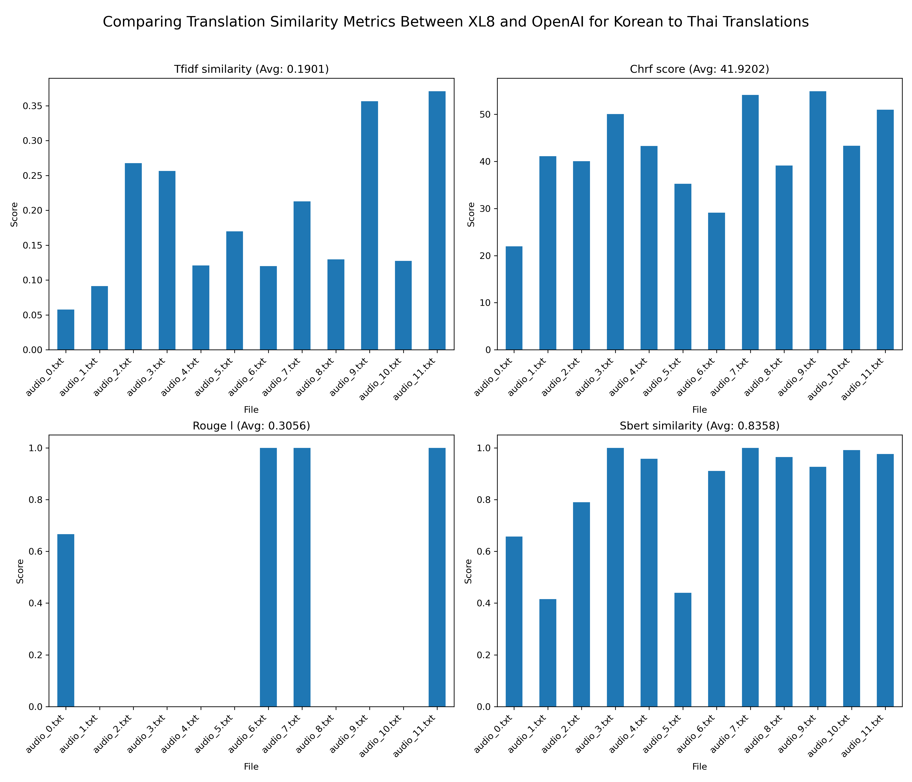

# Real-time live streaming multilingual subtitles system

## Prerequisite and installation

Built and tested with Python 3.12 and FFmpeg version 7.0.2_1

### Required Libraries

#### FFmpeg library

- For Mac, please use `brew install ffmpeg`

- To deploy on Linux server, we need to follow this guideline https://trac.ffmpeg.org/wiki/CompilationGuide/Ubuntu#FFmpeg for install latest version instead of using apt install.

### Project Configuration

```
# Create vitural venv
python3 -m venv venv

# Activate environment
source venv/bin/activate

# Install requirements
pip3 install -r requirements.txt

# If there exists additional install library when developing, please update requirements.txt
pip3 freeze > requirements.txt
```

Run server

```
uvicorn app.main:app --reload
```

Swagger UI for API docs can be checked via http://127.0.0.1:8000/docs

## Project Structure Overview

```
live-streaming-system/
├── app/
│   ├── __init__.py                # Initialization file for the app module
│   ├── main.py                    # Entry point for the FastAPI application
│   ├── core/
│   │   ├── __init__.py
│   │   └── config.py              # Configuration settings for the project
│   ├── api/
│   │   ├── __init__.py
│   │   ├── api_v1/
│   │   │   ├── __init__.py
│   │   │   ├── api.py             # API routing for version 1
│   │   │   ├── endpoints/
│   │   │   │   ├── __init__.py
│   │   │   │   ├── live_stream.py # Endpoints related to live streaming
│   │   │   │   ├── audio_processing.py # Endpoints related to audio processing
│   │   │   │   ├── subtitle_sync.py    # Endpoints related to subtitle synchronization
│   ├── models/
│   │   ├── __init__.py            # Placeholder for database models
│   ├── schemas/
│   │   ├── __init__.py
│   │   ├── live_stream.py         # Pydantic schemas for live streaming
│   │   ├── audio_processing.py    # Pydantic schemas for audio processing
│   │   ├── subtitle_sync.py       # Pydantic schemas for subtitle synchronization
│   ├── services/
│   │   ├── __init__.py
│   │   ├── live_stream_service.py # Implementation logic for live stream service
│   │   ├── audio_service.py       # Implementation logic for audio service
│   │   ├── video_service.py       # Implementation logic for video service
│   │   ├── stt_service.py         # Implementation logic for speech to text service
│   ├── workers/
│   │   ├── __init__.py
│   │   ├── background_tasks.py    # Background task management
│   └── db/
│       ├── __init__.py
│       ├── base.py                # Base model class for ORM
│       └── session.py             # Database session management
├── .env                           # Environment variables
├── .gitignore                     # Git ignore file
├── requirements.txt               # Project dependencies
├── .github                        # GitHub configuration for CI/CD and GitHub PR/Issues Template
└── README.md                      # Project documentation
```

# Testing Guide

Copy `.env.example` and rename it as `.env` and add the API key into this environment variable file. 

Run server with this command

```
uvicorn app.main:app --reload
```

Excute the .m3u8 input link (e.g `http://cache1.castiscdn.com:28080/snu/live.stream/tsmux_master.m3u8`
) via docs API `http://127.0.0.1:8000/docs#/live_stream/process_video_endpoint_api_v1_live_process_stream__post`. 

Open own self-made player (User View) via http://127.0.0.1:8000/static/player.html or VLC Media Play or any Player. 

Input our server endpoint ``http://127.0.0.1:8000/api/v1/streaming/playlist.m3u8` to see the processed streaming video:

# Benchmarking Results

## Benchmarking Results for Speech to Text 
We ran 12 audio files with a total duration of 2 minutes.

Groq consistently has the lowest transcription time, averaging 0.46 seconds, with little variation across all audio files.

OpenAI has a moderate performance, with an average time of 1.60 seconds. There is a slight upward trend for some audio files (e.g., audio_3.wav and audio_6.wav).

Whisper Local is significantly slower, averaging 13.47 seconds per file. It shows a clear downward trend initially, stabilizing around 13–14 seconds after audio_2.wav.


## Benchmarking Results for Translation

For benchmarking the translation output, we prepared 12 .txt files in the subtitles folder. Each file is the output of text to speech service from 10 seconds length. Thus, total length of audio for evaluation is 2 minutes.

For each audio, we use the XL8.ai and GPT-4o from OpenAI for make the translation data for Vietnamese and Thai language.

Then, we use the following metrics for comparing the similarity between translation

- TF-IDF (Term Frequency-Inverse Document Frequency) provides quickly the similarity between two texts based on word occurrences. It assigns higher weights to words that appear frequently in a document but rarely in other documents.

- ChrF measures the similarity between two texts at the character level, which makes it more robust to paraphrasing, word reordering, and morphological variations.

- ROUGE-L evaluates the Longest Common Subsequence (LCS) between two texts. It measures structural similarity, including word overlap and sentence structure alignment. Note that because Thai language does not use spaces to separate words. Therefore, the ROUGE-L metric is less useful for Thai language.

- SBERT (Sentence-BERT) measures the semantic similarity between two texts. It evaluates whether two sentences have the same meaning, regardless of word order or word choice. (Using Sentence Transformer model)

#### Results for Korean to Vietnamese Translation


#### Results for Korean to Thai Translation

