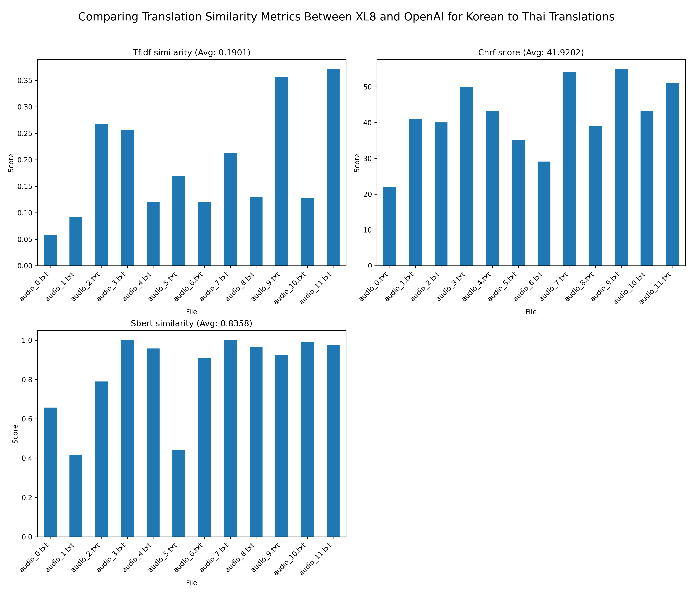

# Benchmarking Results for Speech to Text 
We ran 12 audio files with a total duration of 2 minutes.

Groq consistently has the lowest transcription time, averaging 0.46 seconds, with little variation across all audio files.

OpenAI has a moderate performance, with an average time of 1.60 seconds. There is a slight upward trend for some audio files (e.g., audio_3.wav and audio_6.wav).

Whisper Local is significantly slower, averaging 13.47 seconds per file. It shows a clear downward trend initially, stabilizing around 13–14 seconds after audio_2.wav.

# Benchmarking Results for Translation

For benchmarking the translation output, we prepared 12 .txt files in the subtitles folder. Each file is the output of text to speech service from 10 seconds length. Thus, total length of audio for evaluation is 2 minutes.

For each audio, we use the XL8.ai and GPT-4o from OpenAI for make the translation data for Vietnamese and Thai language.

Then, we use the following metrics for comparing the similarity between translation

- TF-IDF (Term Frequency-Inverse Document Frequency) provides quickly the similarity between two texts based on word occurrences. It assigns higher weights to words that appear frequently in a document but rarely in other documents.

- ChrF measures the similarity between two texts at the character level, which makes it more robust to paraphrasing, word reordering, and morphological variations.

- ROUGE-L evaluates the Longest Common Subsequence (LCS) between two texts. It measures structural similarity, including word overlap and sentence structure alignment. Note that because Thai language doeen't use space for does not use spaces to separate words. Thus, we don't consider this metrics for Thai language.

- SBERT (Sentence-BERT) measures the semantic similarity between two texts. It evaluates whether two sentences have the same meaning, regardless of word order or word choice. (Using Sentence Transformer model)

### Results for Korean to Vietnamese Translation

### Results for Korean to Thai Translation

